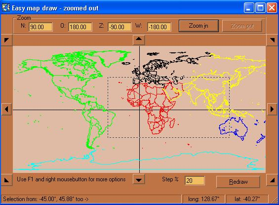



## EasyMapDraw

### Description

it draws a map with the provided coördinates by the user (this can be done in a loop which I call the drawloop, reading them out of a file or inputstream)

IMPORTANT:

download all MP1-files from ftp://ftphost.simtel.net/pub/simtelnet/msdos/worldmap/ first,

and copy them into a folder named Maps. This folder must be placed in the application folder.
 
### More Info
 
* DrawLines yes/no

these lines can be 'broken' by calling BreakLine in the drawloop

* KeyNavigate yes/no : en/dis- ables the keyboard buttons up,down,left and right

* LimitN : specifies the North side limit (note this limit can also be under the equator)

* LimitO, LimitW, LimitZ : like LimitN

if the four Limits are specified, then will form a square that will be shown the first time and which is also the maximum zoom out.

MapBackColor : backcolor

MouseFunction : Zoom or Distance

NavigateStep : how much (%) must the map move up,down,left or right?

Redraw : this will store the map in memory, preventing it from being wiped out. but it's slower. If enabled then you need to avoid DoEvents as much as possible in the drawloop, otherwise it will turn out really slow and crash.

SelectionRange : if the user makes a selection with the mouse, how many pixels must be selected before accepting it as a valid selection?

SelectionRatio : if 0 then it's disabled, otherwise the rectangle of the selection will automatically increase in height according to a ratio of the selected width

* furthermore click the F1 and RightMouse button on the map for examples (like canceling drawing, ...)

* this sample is based on the maps of "The World Digitized" which you can find here

http://uiarchive.uiuc.edu/mirrors/ftp/ftphost.simtel.net/pub/simtelnet/msdos/worldmap/

or by searching on "The World Digitized" and Allison and ftp. "The World Digitized" is copyrighted by John B. Allison 1986

Put the MP1 files in the "maps" folder of this project

* the navigation buttons uses fonttype Wingdings 3

* the bullets came from (not copyrighted)

http://www.ender-design.com/rg/images/bullets/bull_03a.html

* MousePostion(vMouseEvent As enmMouseEvent, vLongitude As Double, vLatitude As Double)

* SelectionCompleted(vLimitN As Double, vLimitO As Double, vLimitZ As Double, vLimitW As Double)

* DistanceCalculated(vDistance As Double, vLatitude1 As Double, vLongitude1 As Double, vLatitude2 As Double, vLongitude2 As Double)

* ZoomError(vZoomError As enmZoomError)

* ZoomConfigured(vZoomdirection As enmZoomDirection) : If this occurs then you can start your drawloop. Don't forget to call EndDraw() when you drawloop is done

* MouseDown(Button As Integer, Shift As Integer,

X As Single, Y As Single)

             |
---                |---
**Submitted On**   |2002-07-03 02:44:26
**By**             |[kris beyers](https://github.com/Planet-Source-Code/PSCIndex/blob/master/ByAuthor/kris-beyers.md)
**Level**          |Advanced
**User Rating**    |5.0 (10 globes from 2 users)
**Compatibility**  |VB 6\.0
**Category**       |[OLE/ COM/ DCOM/ Active\-X](https://github.com/Planet-Source-Code/PSCIndex/blob/master/ByCategory/ole-com-dcom-active-x__1-29.md)
**World**          |[Visual Basic](https://github.com/Planet-Source-Code/PSCIndex/blob/master/ByWorld/visual-basic.md)
**Archive File**   |[EasyMapDra101193722002\.zip](https://github.com/Planet-Source-Code/kris-beyers-easymapdraw__1-36286/archive/master.zip)

